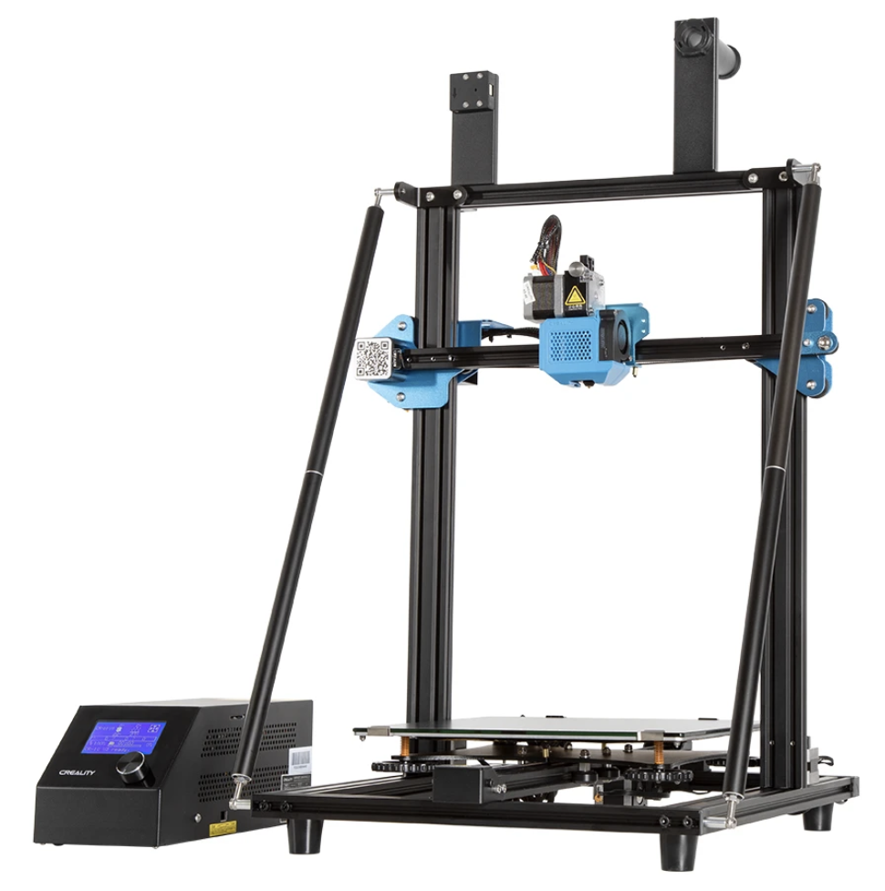

<h1 align="center">Creality CR10v3 Firmware</h1>

  

  <code>Un</code>official Creality CR10v3 firmware

 

  <!-- Node version -->
  
  <!-- Marlin Version -->
  
  <!-- Chat Status -->
  
  
  

  The little project that could. Built with ❤︎ by
  <a href="https://twitter.com/codevski">codevski</a> and
  <a href="#">
    contributors
  </a>

 

## Table of Contents

- [Table of Contents](#table-of-contents)
- [Note](#note)
- [Tweaks](#tweaks)
- [Downloads](#downloads)
- [Changelog](#changelog)

My current CR10v3 firmware forked from [pickysysadmin](https://git.pickysysadmin.ca/FiZi/cr-10-v3-marlin-config) 

## Note
The firmware has X and Y offsets pre-configured in it for the BLTouch based on this mount: [CR-10 V2 BL Touch Mount](https://www.thingiverse.com/thing:3947349)
## Tweaks

Changes/tweaks from stock CR-10 V2 config
- Enabled `POWER_LOSS_RECOVERY`
- Set `CUSTOM_MACHINE_NAME` to match the CR-10 V3 (instead of V2)
- Custom logo/version strings
- Set `HEATER_0_MAXTEMP` to 275 so the maximum temperature of the CR-10 V3 can be reached (260F)
- - Marlin has a built-in saftey where it takes the max temperature, subtracts 15F and then that becomes the max temperature so 275 - 15 = 260
- Set `DEFAULT_AXIS_STEPS_PER_UNIT` so `E0` is `415` for the Titan Drive
- Set `NOZZLE_TO_PROBE_OFFSET` to match where my BLTouch is (you might need to change this)
- Set `INVERT_E*_DIR` to `TRUE` because the Titan drive is backwards I guess?
- Disabled `RESTORE_LEVELING_AFTER_G28` because I use Gcode to handle all this manually and to make sure my bed leveling offsets aren't loaded when I run a mesh-level
- Two builds of the firmware, one with BLTouch enabled and one with it disabled for those who haven't installed a BLTouch yet
## Downloads

Drivers: [th3dstudio](https://support.th3dstudio.com/hc/en-us/articles/360043291432-CH340-Drivers-TH3D-Uno-Creality-V1-1-4-V1-1-5-Board)

Pre-compiled firmware can be found in the [firmware](https://github.com/codevski/CR10v3-Firmware/tree/main/firmware) folder or on the [Releases](https://github.com/codevski/CR10v3-Firmware/releases) page

## Changelog